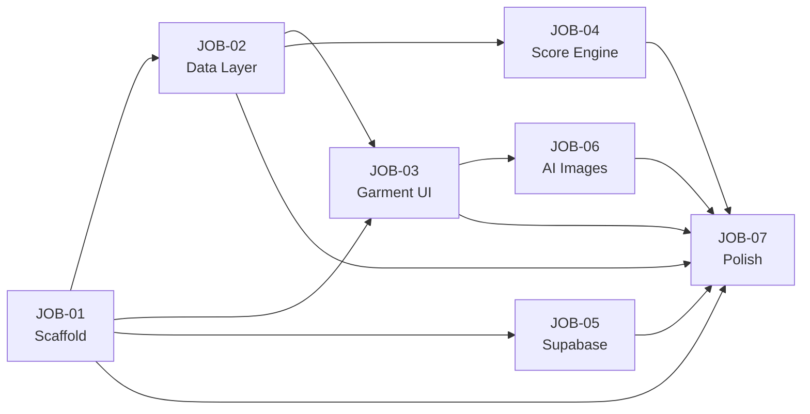

# JOBS — Việt Phục AI Arena MVP

## Execution Order & Dependencies

## Quick Reference

| Job | File | Dependencies | Status |
|-----|------|-------------|--------|
| 01 | `JOB-01-scaffold.md` | None | ✅ Done |
| 02 | `JOB-02-data-layer.md` | JOB-01 | ✅ Done |
| 03 | `JOB-03-garment-ui.md` | JOB-01, JOB-02 | ✅ Done |
| 04 | `JOB-04-score-engine.md` | JOB-02 | ✅ Done |
| 05 | `JOB-05-supabase.md` | JOB-01, User credentials | ✅ Done |
| 06 | `JOB-06-ai-images.md` | JOB-03 | ✅ Done |
| 07 | `JOB-07-polish.md` | All previous | ✅ Done |

## Parallel Execution

Jobs that can run in parallel:
- **Batch 1**: JOB-01 (alone)
- **Batch 2**: JOB-02 (after JOB-01)
- **Batch 3**: JOB-03 + JOB-04 + JOB-05 (after JOB-02, JOB-05 needs credentials)
- **Batch 4**: JOB-06 (after JOB-03)
- **Batch 5**: JOB-07 (after all)

## Instructions for Gemini Agent

1. Read the JOB file completely before starting
2. Check **Input** section — read all referenced files first
3. Follow **Tasks** in order within each job
4. After completing, verify against **Acceptance Criteria**
5. Update the status in this README from ⬜ to ✅
6. The working directory is always `AI-Arena/vietphuc-app/` unless stated otherwise

## Project Context

- **Framework**: React 19 + Vite 8 + TailwindCSS v4
- **Data**: JSON files in `AI-Arena/data/`
- **MVP garments**: Áo dài, Áo tứ thân, Áo ngũ thân, Áo nhật bình, Áo bà ba
- **Art style**: Realistic watercolor 2D illustrations
- **Backend**: Supabase (DB + Storage)
